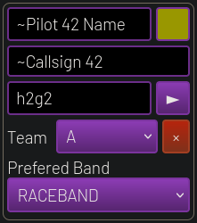
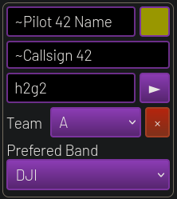

# RotorHazard DJI pilots plugin

This plugin will add an option on pilots to mark them as "DJI".

Then, during heat auto-frequency generation, DJI pilots will be associated to
nodes with DJI frequencies instead of Raceband.

## Installation

Copy the `rh_dji_pilots` plugin into the `src/server/plugins` directory in your RotorHazard install. Start RotorHazard.

If installation is successful, the RotorHazard log will contain the message `Loaded plugin module rh_dji_pilots` at startup.

## Usage

While creating a pilot, a DJI option should be visible to let you select the prefered setup.

