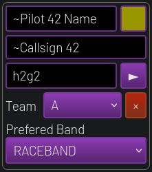
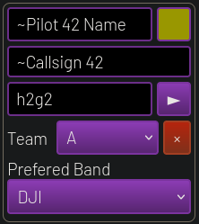

# RotorHazard DJI pilots plugin

This plugin for [RotorHazard](https://github.com/RotorHazard/RotorHazard) will add an option on pilots to mark them as "DJI".

Then, during heat auto-frequency generation, DJI pilots will be associated to nodes with DJI frequencies instead of Raceband.

# How to Install
There are 2 ways you can install this plugin
1. Though RotorHazards community plugin manager on RotorHazard 4.3.0 or greater:
   This can be found on your timer which must be connected to the internet by going to settings -> plugins -> Browse Community Plugins (online only) -> Utilities then install the DJI Pilots plugin

2. Run the following command in the SSH terminal to install the DJI Pilots plugin
  ```
  cd ~
  wget https://github.com/arnaudmorin/RotorHazard-DJI-Pilots/archive/refs/heads/main.zip
  unzip ./main.zip
  rm -R ~/rh-data/plugins/dji_pilots
  mv ~/RotorHazard-DJI-Pilots-main/custom_plugins/dji_pilots/ ~/rh-data/plugins/
  rm -R ./RotorHazard-DJI-Pilots-main
  rm ./main.zip
  sudo systemctl restart rotorhazard.service
  ```

If installation is successful, the RotorHazard log will contain the message `Loaded plugin module rh_dji_pilots` at startup.

# Usage

While creating a pilot, a DJI option should be visible to let you select the prefered setup.



